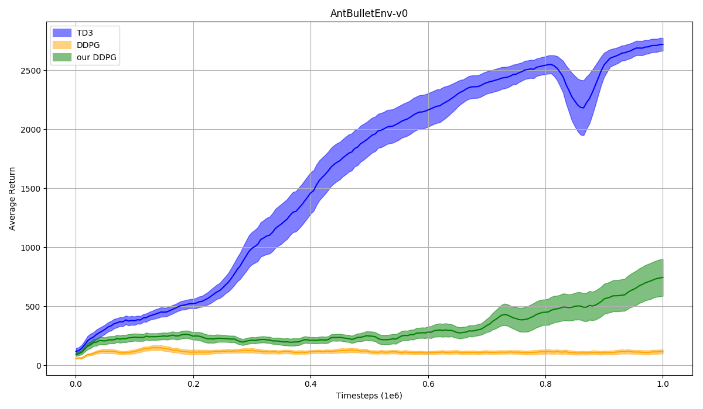

# Benchmarking TD3 and DDPG on PyBullet

This repo contains benchmark results for TD3 and DDPG using the [PyBullet](https://docs.google.com/document/d/10sXEhzFRSnvFcl3XxNGhnD4N2SedqwdAvK3dsihxVUA/edit#) reinforcement learning environments:
* Ant
* HalfCheetah
* Hopper
* InvertedPendulum
* InvertedDoublePendulum
* Reacher
* Walker2D

In the [TD3 paper](https://arxiv.org/abs/1802.09477), results were reported for the [MuJoCo](http://www.mujoco.org/) version of these environments. PyBullet is a free and open-source alternative to MuJoCo, with no license fees and no hardware lock (MuJoCo personal licenses are limited to 3 physical machines, which means you cannot run simulations in the cloud, e.g. AWS/GCP/etc).

This repo itself is a fork of the [official TD3 code](https://github.com/sfujim/TD3/) from the original authors of TD3. Per the original repo, results were generated with Python 2.7 and PyTorch 0.4. Specific to this repo, PyBullet 2.4.8 was used. To obtain these results, run:
```
./run_experiments.sh
```

## Learning curves
Below are the learning curves for TD3, OurDDPG, and DDPG, using the algorithms in 'TD3.py', 'OurDDPG.py', and 'DDPG.py'. Results for "TD3" and "OurDDPG" should serve as the PyBullet counterpart to the MuJoCo-based results in the original paper. Note the results for "DDPG" do *not* correspond to those presented in the TD3 paper (see [original README file](README_orig.md)), but still serve as a good reference point nonetheless.

Per the TD3 paper, in the learning curves, the solid line represents the average over 10 trials, whereas the shaded area represents half a standard deivation over those 10 trials. The curves were smoothed uniformly for visual clarity, using `scipy.ndimage.uniform_filter(data, size=7)` (the window size was chosen arbitrarily by me).





For more details on how the curves were generated, see 'plot_results.py', and also the original TD3 paper. To generate the plots yourself:
```
python plot_results.py
```

## Pre-trained models
Pre-trained models can be downloaded from [here](https://drive.google.com/open?id=1x88F-Uop6zCI0jnY8F4E9TsKsXCtq-fL).

## Agent visualization
Here is an example of how to visualize a saved agent in action:
```
python eval.py --policy TD3 --env_name HalfCheetahBulletEnv-v0 --filename TD3_HalfCheetahBulletEnv-v0_0 --visualize
```

For more details, please refer to the code in 'eval.py'.
